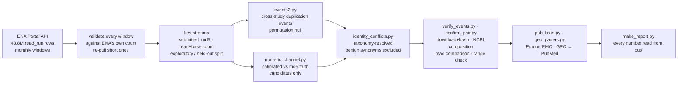

# Same bytes, different organism

**A checksum census of duplicate raw-read deposits in the INSDC sequence archives.**

The world's primary raw-sequencing archives (ENA / SRA / DDBJ) contain byte-identical copies of the same sequencing data deposited under separate accessions — and a subset of those copies declare *different biological identities*: different named bacterial isolates, different plant species, different human donors. Some of them sit in reference collections and behind published *Nature* and *Science* papers.

Nobody had looked, because the checksum field everyone would reach for (`fastq_md5`) is structurally incapable of revealing it.

> **Read the finding:** [`REPORT.md`](REPORT.md) · **Check the work:** [`log/`](log/) · Public data only, no credentials, reproducible with `./run_all.sh`.

---

## The census in numbers

| | |
|---|---|
| Runs in the whole archive | 43,824,523 |
| Runs in count-verified windows | **6,827,778** (15.6% · 2010–2018 complete) |
| Windows validated against ENA's own counts | 132 / 132 |
| Runs carrying a usable submitter checksum | 1,873,023 |
| **Duplication events** (same file, more than one study) | **201** across **507 studies** |
| Runs involved | 25,082 (1.34% of checksum-bearing runs) |
| **Redundant storage** | **10.83 TB** |
| Studies whose own BioSamples duplicate each other | 129 |
| Identity-conflict pairs (two deposits, two different identities) | 4,328 → **278 study-pairs** |
| …of which organism-level (different species or wider) | **67** |
| Events spanning more than one institution | 31 |
| Preregistered hypotheses passing on held-out data | **4 / 4** |

Every case in the report was checked against the **actual data**, not the metadata — by downloading and hashing both files, by comparing NCBI's exact A/C/G/T/N base composition, by comparing the first 2,000 read sequences with headers ignored, or by HTTP range-checking multi-gigabyte files. A seeded random sample of 150 identity conflicts: **146 confirmed, 2 refuted, 2 no fingerprint** (98.6%). The two refutations are the point — the check discriminates rather than rubber-stamps.

## Six verified cases

| | What the archive says | What the bytes say |
|---|---|---|
| **1** | `SRR070588` is *Staphylococcus lugdunensis* VCU148; `SRR071318` is *S. epidermidis* VCU111 (JCVI, two BioProjects, two assemblies) | First 2,000 reads identical in the same order; identical composition (246,604 spots) |
| **2** | `SRR063729` / `SRR063733` / `SRR063735` are *Finegoldia magna*, *Peptoniphilus* sp., *Streptococcus mitis* — **three genera** | One 454 run, identical reads |
| **3** | `SRR1021212` is *E. coli* O157:H7; `SRR1031053` is *Listeria monocytogenes* — **different phyla** (NIST) | Identical composition and reads |
| **4** | `ERR016531` is wheat (Liverpool); `ERR024102` is potato (Dundee) | Same 2,167,347,440-byte SFF file, same `submitted_md5`, same head/tail 5 MB by range request |
| **5** | `SRR543504` is *"healthy human donor 2"* (Yu *et al.*, **Nature** 2012); `SRR578255` is *"healthy human donor 7"* (Yu *et al.*, **Science** 2013) | One library: 58,602,670 reads, identical composition, identical first 2,000 reads |
| **6** | One *M. tuberculosis* isolate deposited as three isolates by Basel, Borstel, and the Institute of Tropical Medicine | Same file at three FTP paths, same checksum, three BioSamples |

## Why it was invisible

```
submitter uploads  ──►  ENA stores the object  ──►  ENA regenerates FASTQ per accession
      │                        │                          │
      │                        │                          └─ run accession written into
      │                        │                             every read header
      │                        └─ submitted_md5   ← checksum of the bytes uploaded
      └─                                                    (identical data ⇒ identical md5)
                                                          fastq_md5 ← checksum of the
                                                            regenerated file
                                                            (identical data ⇒ DIFFERENT md5)
```

Measured on one fresh window (15,999 runs): 22,044 distinct `fastq_md5` values, **0 collisions**. The signal lives only in `submitted_md5`, which is present for 100% of ENA-submitted (ERR) runs and ~0% of SRR/DRR — NCBI's public metadata dumps strip the per-file checksum block. The SRR side is therefore reached through a calibrated numeric channel (read count + base count: recall 100%, precision 9%) used **only to generate candidates**, each then confirmed against NCBI's exact base composition.

## Why it matters

- **Pooled analyses count the same data twice.** ENA's own curation paper (*Database* 2016) tabulates two studies side-by-side as independent; they share 56 byte-identical files.
- **In pathogen genomics a duplicate is indistinguishable from a transmission event.** Identical genomes give a SNP distance of zero — the strongest evidence of recent transmission. The nine-study *M. tuberculosis* component here includes data behind a paper titled *"Standard Genotyping Overestimates Transmission of M. tuberculosis"*.
- **It is against stated policy.** NCBI SRA submission standards: *"Duplicate submissions are not permitted; reference the existing accession instead."*
- **Public INSDC records are never withdrawn.** Reference collections inherit the error permanently.

## How the pipeline works



The exploratory/held-out split is at `first_public = 2014-09-01`. Hypotheses, disconfirmation thresholds and two amendments were frozen in [`log/02-preregistration.md`](log/02-preregistration.md) before held-out data was analysed — including a recorded deviation (smoke tests touched held-out output), which is why the case studies are labelled exploratory and only the quantitative thresholds count as confirmatory.

## Six ways the numbers were silently wrong first

All found, all fixed, all logged in [`log/03-worklog.md`](log/03-worklog.md):

1. `curl | gzip` discards curl's exit status — a dropped connection looked like success.
2. A truncated HTTP response still gzips cleanly, so a gzip-integrity check passed short files (one window held 144,991 of 250,426 runs).
3. **ENA's `first_public <= E` is exclusive of E.** Every window silently lost its last day; single-day windows returned zero while passing their own count check. Fix: half-open consecutive boundaries plus a *global* test — the sum of all windows must equal ENA's count for the whole archive.
4. Legacy annual files would have been double-counted alongside monthly ones.
5. February windows hardcoded to 29 days.
6. An early verification pass silently skipped 8 of 10 events for exceeding a file-size cap — replaced by event-stratified sampling with a read-level fallback that costs the same for a 200 GB run as a 2 MB one.

Plus a data-format trap worth knowing: a stray `"` in `center_name` makes `csv.DictReader` swallow following lines. Use `quoting=csv.QUOTE_NONE` on any ENA TSV.

## Reproduce

```bash
./run_all.sh     # ~1–2 h of ENA downloads (~8 GB gz) + ~20 min local analysis
```

No credentials required anywhere. Environment pinned in `env.txt` (Python 3.14, numpy 2.4, pandas 3.0, scipy 1.17); fixed seed `20260906` in `src/params.py`. ENA's portal API delivers ~48 kB/s per connection, ~150–170 kB/s aggregate — that, not compute, is the wall-clock cost.

## Layout

```
REPORT.md            the finding, verified cases, the harshest fair criticism and answers,
                     preregistered-hypothesis verdicts
REPORT_NARRATIVE.md  narrative sections      REPORT_NUMBERS.md   generated figures
REPORT_CRITICISM.md  objections, answered
src/                 pipeline — see run_all.sh for order
  pull_one.sh        hardened window puller (count-validated)
  events2.py         cross-study duplication events + permutation null
  numeric_channel.py read/base-count channel, calibrated against md5 ground truth
  identity_conflicts.py · taxonomy_ena.py   conflicting-identity detection
  verify_events.py · confirm_pair.py · ncbi_fingerprint.py · compare_reads.py · range_check.py
  pub_links.py · geo_papers.py · pairs_to_papers.py    publication linkage
  make_report.py     assembles the report; every number read from out/
log/                 preregistration, amendments, worklog with dead ends, tally of everything tried
out/                 results (large key streams are regenerated, not committed)
data/                downloaded metadata (not committed)
```

Superseded scripts are kept on purpose: `src/pull_ena.sh` (three integrity bugs are documented against it), `src/taxonomy.py` (taxdump downloads kept truncating), `src/verify_download.py` (the size-biased pass).

## Reading order for someone checking this work

1. [`log/02-preregistration.md`](log/02-preregistration.md) — hypotheses and thresholds, frozen first
2. [`log/01-candidates-and-decision.md`](log/01-candidates-and-decision.md) — 18 archives probed, 10 targets considered, what was killed and why
3. [`log/03-worklog.md`](log/03-worklog.md) — what failed, including a false refutation that took an hour to understand
4. [`log/99-tally.md`](log/99-tally.md) — count of everything tried
5. [`REPORT.md`](REPORT.md) — the finding

## Ranked next steps

1. **Extend the exact channel to NCBI-submitted runs.** NCBI's per-run XML does expose the original file MD5 (`<SRAFile supertype="Original">`) — it is only missing from the bulk dumps. A targeted sweep over the numeric-channel candidates would turn the SRR/DRR lower bound into a real census.
2. **Measure the pathogen-genomics consequence.** Re-run a published *M. tuberculosis* transmission analysis with duplicates collapsed and count how many zero-SNP links disappear.
3. **Ask ENA and NCBI to publish content fingerprints** — a hash of the sorted read sequences, independent of format, compression and headers, would have caught every case here at submission time.

## Data and licence

- ENA Portal API, `result=read_run` — EMBL-EBI Terms of Use; INSDC records carry no restriction on reuse
- NCBI SRA per-run XML — US Government work, public domain
- ENA taxonomy REST; Europe PMC REST (CC-BY)

Code in this repository is MIT licensed. Built 2026-09-06/07.
